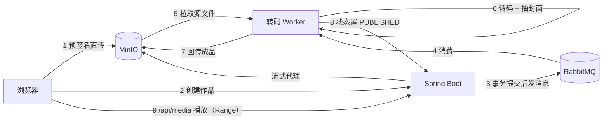

# 拾光（Shiguang）

清新明亮的短视频 & 图文分享社交平台 · 求职作品

抖音式竖屏信息流，手机 / PC 双端自适应。从发布到播放是一条完整的媒体流水线：**预签名直传对象存储 → 消息队列异步转码 → 后端流式代理播放**。

<!-- 截图占位：上线后在此补充产品截图（建议：移动端信息流 / PC 首页 / 发布页 / 评论区 / 私信 / 个人主页） -->

## 功能一览

**内容与发布**
- 视频 / 图文发布（图文最多 18 张）、封面可选，发布前本地预览与上传进度
- MinIO 预签名直传：大文件不占用应用服务器的带宽与磁盘
- RabbitMQ + FFmpeg 异步转码：1080P / 30fps / 限码率，自动抽取封面、清理源文件
- 作品管理：仅自己可见、编辑文案、删除（含存储对象清理）

**信息流**
- 一屏一卡：移动端上下滑动 / PC 滚轮翻页
- 已看沉底 + 看完轮换重播（Redis ZSET 记录观看历史）
- 断点续播：返回后从上次进度继续；离场帧快照消除黑屏
- 可拖动进度条（拖动显示时间气泡）、多图左右滑动、单作品页

**互动**
- 点赞、收藏（乐观更新；计数按实际数据聚合，不维护冗余计数以免漂移）
- 二级评论：回复默认折叠、@ 提示、作者标签、图片评论（≤3 张）、级联删除
- 分享面板：把作品卡片发给最近聊过的好友 / 复制链接

**社交与隐私**
- 关注 / 粉丝、互相关注标识、备注；主页作品 / 点赞 / 收藏列表
- 隐私设置：点赞、收藏、粉丝、关注四项独立可见性（公开 / 好友 / 私密）

**消息**
- 通知中心：点赞折叠（「A、B、C 等 N 人赞了你的作品」）、评论 / 关注分类、未读红点、点击直达对应楼层
- 私信：WebSocket 实时推送、图片与作品卡片消息、非互关先发方限 1 条、顶部新消息浮层
- 会话列表、未读合并红点

**账号**
- 手机号 + 验证码登录（开发环境固定 123456）、JWT 双令牌（访问 + 刷新）
- 资料编辑、头像上传

## 技术栈

| 层 | 技术 |
| --- | --- |
| 后端 | Java 21 · Spring Boot 3.5 · Maven · MyBatis-Plus · Spring Security + JWT · WebSocket |
| 中间件 | MySQL 8 · Redis（验证码限流 / 观看历史 / 首页缓存）· RabbitMQ（转码队列）· MinIO（S3 兼容对象存储）· FFmpeg |
| 前端 | Vue 3 · Vite · Pinia · Element Plus · 手机 / PC 双端自适应 |

## 架构速览：媒体流水线



**关键设计**
- 文件不经过应用服务器：上传走预签名直传，播放走后端 Range 流式代理（支持拖动进度条与长缓存）
- 转码全程异步：事务提交后才投递消息；消费幂等（状态非 PROCESSING 直接跳过），失败标记可追踪
- 对象名带随机 UUID、内容不变 → 可加 `immutable` 长缓存；存储层接口化，可无缝切换阿里云 OSS / 腾讯云 COS
- 游标分页、乐观更新、幂等点赞 / 收藏、通知折叠等细节见 `docs/` 设计文档

## 项目结构

```
db/init/            数据库脚本：001 全量建库 + 002~012 里程碑增量
src/main/java/com/shiguang/
  auth/             验证码登录、JWT 双令牌
  user/             用户、关注 / 粉丝、隐私设置
  content/          作品发布 + 转码状态机（transcode/ 子包：RabbitMQ + FFmpeg）
  storage/          存储抽象：MinIO 预签名直传 / 媒体 Range 代理
  feed/             信息流、观看历史、点赞 / 收藏列表
  interaction/      点赞、收藏、评论（二级回复、评论图片）
  notification/     通知中心（折叠 / 未读 / 定时清理）
  message/          私信（WebSocket 推送、会话、富媒体消息）
  admin/            管理员作品管理（下架 / 恢复 / 删除、全量筛选）
  common/ config/   统一响应、异常、安全配置
frontend/src/       Vue 3 前端（移动端 / PC 双端组件与视图）
src/test/java/      JUnit 测试（单元 + 接口集成 + 并发）
docs/               设计文档与实施计划
```

## 本地开发

依赖：JDK 21、MySQL 8（库 `shiguang`）、Redis、MinIO、RabbitMQ、FFmpeg。

```powershell
# 1. 初始化数据库（001 建库建表；002~012 为里程碑增量，按编号顺序）
Get-ChildItem db\init\*.sql | Sort-Object Name | ForEach-Object { mysql -uroot -p < $_.FullName }

# 2. 一键启动（中间件 + 后端 8080 + 前端 5173）
powershell -ExecutionPolicy Bypass -File .devtools\start-all.ps1

# 停止前后端（中间件保持运行）
powershell -ExecutionPolicy Bypass -File .devtools\start-all.ps1 -Stop
```

> 一键脚本基于本机 `.devtools` 便携版布局（Redis / MinIO / FFmpeg 等绿色版组件）；从零搭建可参考 `start-dev.ps1` 中的启动参数自行安装。
> 开发期短信为 Mock（固定 `123456`）；接口文档：`http://localhost:8080/swagger-ui/index.html`

### 管理员账号（作品管理后台）

`user.role` 默认 `USER`。提升管理员在数据库里单独执行，**不要把真实手机号提交进仓库**：

```sql
UPDATE `user` SET `role` = 'ADMIN' WHERE `phone` = '<管理员手机号>';
```

管理员登录后从「个人主页 → ⋯ → 管理后台」进入 `/admin`：可按状态 / 可见性 / 作者 / 作品 ID 筛选全量作品，并下架（可填原因，作者可见）、恢复、删除。权限在服务端每次查库校验，非管理员请求 `/api/admin/**` 一律 403。

## 测试

- 后端：14 个测试类 / 59 个用例（登录、发布状态机、转码、关注、互动与并发点赞）
- 端到端：移动端 430×900 与 PC 1400×900 双端无头浏览器回归（Edge CDP）

## 里程碑

- M1 登录注册与用户模块
- M2 内容发布：存储直传 + FFmpeg 转码队列 + 作品详情 / 删除
- M3 作品管理与信息流：仅自己可见 / 编辑 / 删除、播放列表轮换与已看上报
- M4 二级评论：回复、@、作者标签、级联删除
- M5 通知中心：点赞折叠、单作品页、返回瞬间定位
- M6 私信系统：WebSocket 实时聊天、图片 / 作品卡片、新消息浮层
- M7 关注通知去重
- M8 收藏：作品收藏、主页收藏 Tab
- M9 可见性设置：点赞 / 收藏 / 粉丝 / 关注四项可见性
- M10 消息富媒体：评论图片、私信表情 / 图片、分享面板
- M11 播放量统计：有效观看上报、进度条、断点续播
- M12 管理员作品管理：角色权限、全量作品筛选、下架 / 恢复 / 删除
- 规划中：部署上线（Nginx / HTTPS / 前端拆包优化）
